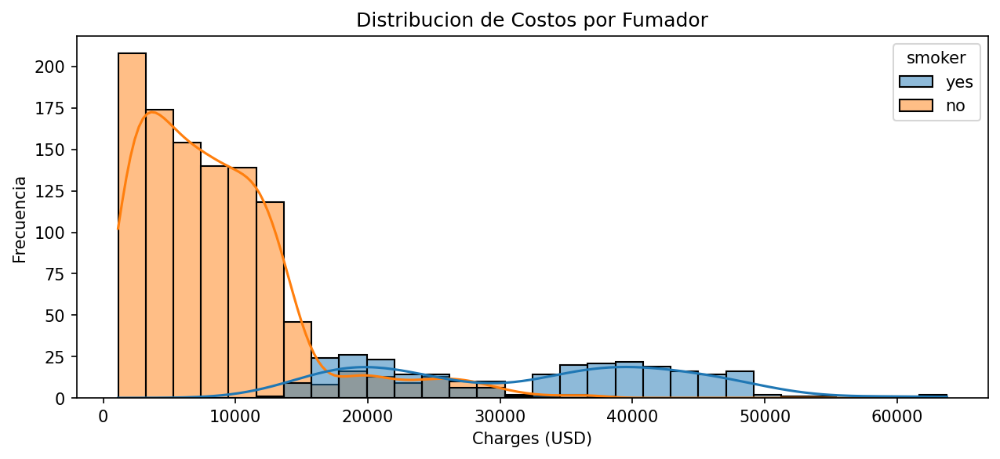
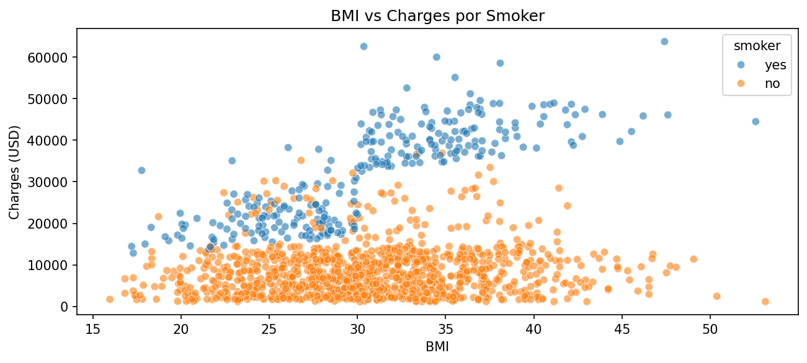
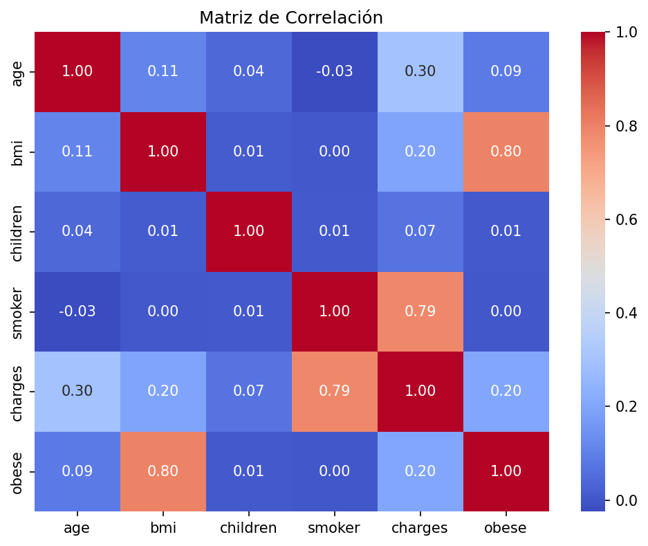
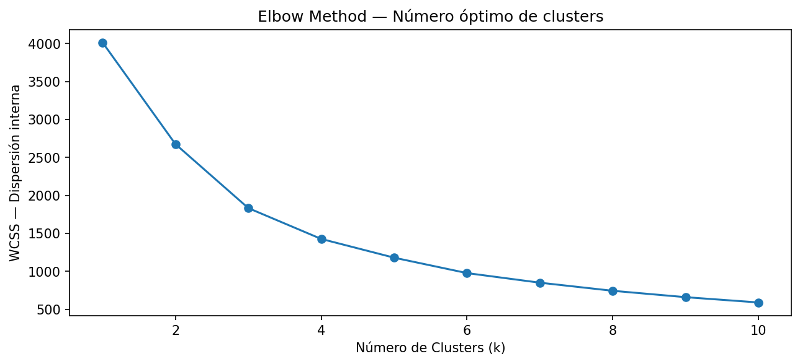
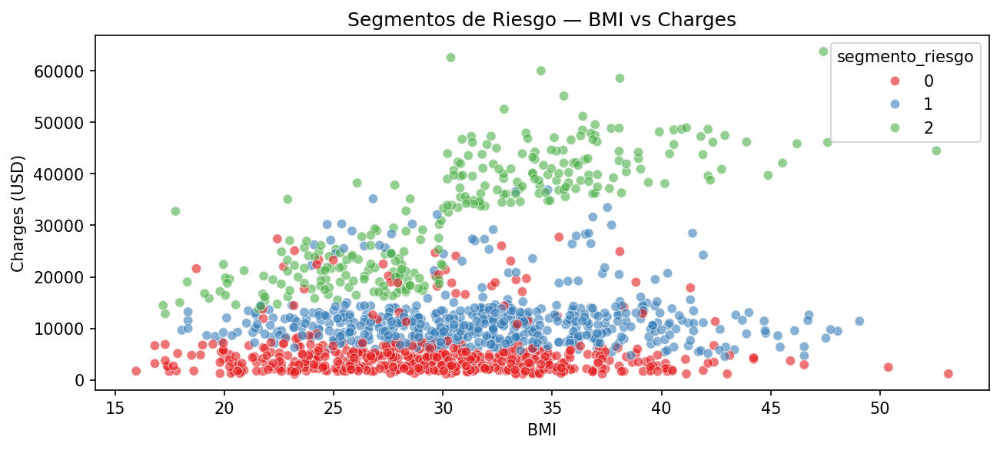
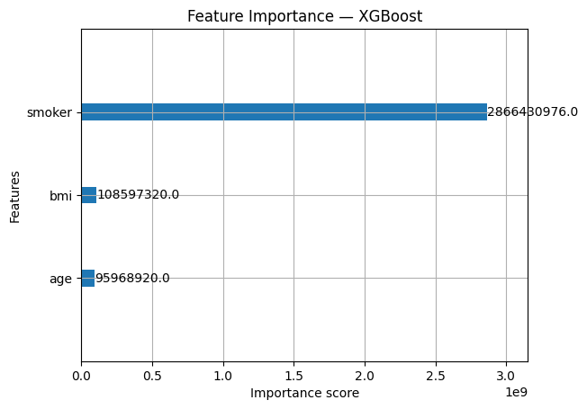
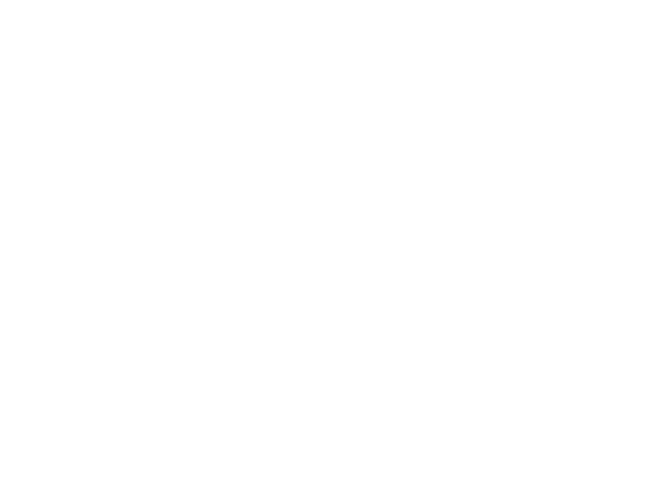

# Vortex: Medical Insurance Risk Segmentation & Cost Prediction

> Pipeline completo de Machine Learning para segmentación de asegurados por perfil de riesgo médico (K-Means) y predicción del costo de cobertura (Regresión Lineal), aplicado al dataset Medical Insurance Cost de Kaggle.

---

## Tabla de Contenidos
- [Pregunta de Negocio](#pregunta-de-negocio)
- [Dataset](#dataset)
- [Tecnologías y Librerías](#tecnologías-y-librerías)
- [Desarrollo](#desarrollo)
- [Resultados](#resultados)
- [Conclusiones y Respuesta a la Pregunta de Negocio](#conclusiones-y-respuesta-a-la-pregunta-de-negocio)
- [Limitaciones y Trabajo Futuro](#limitaciones-y-trabajo-futuro)
- [Learnings](#learnings)
- [Sobre el Uso de IA](#sobre-el-uso-de-ia)
- [Cómo Replicar](#cómo-replicar)
- [Referencias](#referencias)

---

## Pregunta de Negocio

¿Es posible segmentar a los asegurados según su perfil de riesgo médico y, a partir de ello, predecir el costo de cobertura que representa cada cliente para la compañía aseguradora?

Este proyecto aborda dos preguntas complementarias que en la práctica actuarial se usan de forma secuencial:

1. **Segmentación:** ¿Qué perfiles de riesgo existen naturalmente en la cartera de clientes? → K-Means Clustering
2. **Predicción:** ¿Cuánto costará cubrir a un nuevo asegurado antes de su incorporación? → Regresión Lineal

La combinación de ambos enfoques permite a una aseguradora tomar decisiones concretas sobre **pricing de primas**, **estrategia de adquisición de clientes** y **gestión de riesgo de cartera**.

---

## Dataset

| Campo | Detalle |
|-------|---------|
| **Fuente** | [Kaggle - Medical Insurance Cost](https://www.kaggle.com/datasets/mirichoi0218/insurance) |
| **Descripción** | Datos demográficos y de salud de asegurados en EE.UU. con su costo de cobertura anual |
| **Dimensiones** | 1,338 filas × 7 columnas |
| **Calidad** | Sin valores nulos. Dataset limpio listo para modelado. |

| Variable | Tipo | Descripción |
|----------|------|-------------|
| `age` | Numérica | Edad del asegurado |
| `bmi` | Numérica | Índice de masa corporal |
| `smoker` | Categórica | Fumador: yes / no |
| `children` | Numérica | Número de hijos cubiertos |
| `region` | Categórica | Región geográfica en EE.UU. |
| `sex` | Categórica | Género del asegurado |
| `charges` | Numérica | Costo anual de cobertura en USD (variable objetivo) |

---

## Tecnologías y Librerías

**Lenguaje:** Python 3.x
**Entorno:** Jupyter Notebook
**Control de versiones:** Git + GitHub con feature branch workflow

| Librería | Uso |
|----------|-----|
| `pandas` | Carga, transformación y manipulación del dataset |
| `numpy` | Operaciones numéricas y transformación logarítmica |
| `matplotlib` | Construcción base de visualizaciones |
| `seaborn` | Histogramas, scatter plots, heatmaps estadísticos |
| `scikit-learn` | StandardScaler, KMeans, LinearRegression, train_test_split, métricas |
| `joblib` | Serialización y persistencia de modelos entrenados (`.pkl`) |

---

## Desarrollo

### Etapa 1: Exploración de Datos (EDA)

El EDA partió de hipótesis de negocio formuladas antes de escribir código: se esperaba que `smoker` y `bmi` fueran los principales determinantes del costo de cobertura. El análisis confirmó y enriqueció estas hipótesis con evidencia empírica.

**Análisis estadístico descriptivo:**
- `charges` presenta media de ~$13,270 con std de ~$12,110, una desviación estándar casi igual a la media que indica alta dispersión y distribución sesgada a la derecha.
- Rango de $1,121 a $63,770, con el 75% de los clientes por debajo de $16,639.

```python
df_insurance.shape       # (1338, 7)
df_insurance.info()      # sin valores nulos, tipos de datos mixtos
df_insurance.describe()  # estadísticas descriptivas completas
```

**Hallazgos visuales:**

La distribución de `charges` es **bimodal**: un grupo principal concentrado bajo $15,000 y un segundo grupo entre $30,000-$50,000. Al segmentar por `smoker`, se confirma que el segundo grupo corresponde casi exclusivamente a fumadores.

```python
sns.histplot(data=df_insurance, x='charges', bins=30, kde=True, hue='smoker')
```



El scatter plot BMI vs Charges reveló un **umbral en BMI = 30** (frontera clínica de obesidad) donde los fumadores registran un salto de ~$15,000 a ~$40,000+ en costos, evidenciando un efecto de interacción `smoker × bmi`.

```python
sns.scatterplot(data=df_insurance, x='bmi', y='charges', hue='smoker', alpha=0.6)
```



**Matriz de correlación:**

| Variable | Correlación con `charges` |
|----------|--------------------------|
| `smoker` | **0.79** |
| `age` | 0.30 |
| `bmi` | 0.20 |
| `children` | 0.07 |

`children`, `region` y `sex` fueron descartadas por baja correlación con `charges` y riesgo de introducir overfitting.



---

### Etapa 2: Segmentación de Clientes con K-Means

**Variables seleccionadas:** `age`, `bmi`, `smoker`

**Estandarización con StandardScaler:**

K-Means opera sobre distancias euclidianas. Sin estandarización, `age` (rango ~46 unidades) dominaría sobre `smoker` (rango 0-1), sesgando los clusters. StandardScaler transforma cada variable a media=0 y std=1 (Z-score).

```python
from sklearn.preprocessing import StandardScaler
scaler = StandardScaler()
X_scaled = scaler.fit_transform(df_insurance[['age', 'bmi', 'smoker']])
```

**Selección de k con Elbow Method:**

Se evaluó el WCSS para k=1 a k=10. El codo más pronunciado se identifica en k=3.

```python
wcss = []
for k in range(1, 11):
    kmeans = KMeans(n_clusters=k, random_state=42, n_init=10)
    kmeans.fit(X_scaled)
    wcss.append(kmeans.inertia_)
```



```python
# Modelo final con k=3
kmeans = KMeans(n_clusters=3, random_state=42, n_init=10)
kmeans.fit(X_scaled)
df_insurance['segmento_riesgo'] = kmeans.labels_
```



---

### Etapa 3: Predicción de Costo con Regresión Lineal

**Variables input:** `age`, `bmi`, `smoker` | **Variable objetivo:** `charges`
**Split:** 80% entrenamiento (1,070 registros) / 20% prueba (268 registros)

```python
from sklearn.linear_model import LinearRegression
from sklearn.model_selection import train_test_split

X = df_insurance[['age', 'bmi', 'smoker']]
y = df_insurance['charges']

X_train, X_test, y_train, y_test = train_test_split(X, y, test_size=0.2, random_state=42)

model = LinearRegression()
model.fit(X_train, y_train)
y_pred = model.predict(X_test)
```

**Experimento con transformación logarítmica:**

Se exploró `np.log(charges)` como variable objetivo para mitigar el sesgo a la derecha. El modelo log-transformado produjo peores resultados (R²=0.52 vs 0.77). La causa: `smoker` genera un salto discreto en `charges` que no es una distorsión de escala sino una relación estructuralmente no lineal, no solucionable con transformaciones sobre el target.

---

### Etapa 4: Mejora del Modelo con XGBoost

**Variables input:** `age`, `bmi`, `smoker` | **Variable objetivo:** `charges`
**Split:** 80% entrenamiento (1,070 registros) / 20% prueba (268 registros)

Dada la limitación de la regresión lineal para capturar la relación no lineal entre `smoker` y `charges`, se implementó **XGBoost Regressor**, un algoritmo basado en gradient boosting que entrena árboles de decisión secuencialmente, donde cada árbol corrige los errores del anterior.

**Modelos entrenados:**

1. **XGBoost Base:** Configuración por defecto (n_estimators=100, max_depth=6)
2. **XGBoost Ajustado (v1):** Balance entre capacidad y generalización (n_estimators=500, max_depth=4, learning_rate=0.05)
3. **XGBoost Ajustado (v2):** Mayor regularización para datasets pequeños (n_estimators=1000, max_depth=5, learning_rate=0.01, subsample=0.8, colsample_bytree=0.8)

```python
from xgboost import XGBRegressor

# Modelo XGBoost Ajustado v2 (mejor desempeño)
model_xgb = XGBRegressor(
    n_estimators=1000,
    max_depth=5,
    learning_rate=0.01,
    subsample=0.8,
    colsample_bytree=0.8,
    random_state=42
)
model_xgb.fit(X_train, y_train)
y_pred_xgb = model_xgb.predict(X_test)
```

---

## Resultados

### Segmentación: Perfiles de Riesgo Identificados

| Segmento | Perfil | Age promedio | BMI promedio | Fumador | Charges promedio | N clientes |
|----------|--------|-------------|-------------|---------|-----------------|-----------|
| 0 | **Bajo riesgo** | 26.8 años | 29.4 | No | $5,059 | 516 (38.6%) |
| 1 | **Riesgo medio** | 51.2 años | 31.8 | No | $11,611 | 548 (40.9%) |
| 2 | **Alto riesgo** | 38.5 años | 30.7 | Sí | $32,050 | 274 (20.5%) |

### Predicción de Costos: Comparativa de Modelos

| Métrica | Regresión Lineal | XGBoost Base | XGBoost Tuned (v2) |
|---------|-----------------|--------------|-------------------|
| **R²** | 0.77 | 0.82 | **0.86** |
| **MAE** | $4,260 | $2,957 | **$2,652** |
| **RMSE** | $5,874 | $5,226 | **$4,642** |

**Análisis de mejora:**

XGBoost mejoró significativamente el desempeño respecto a regresión lineal:
- **R² mejoró en +0.09** (de 0.77 a 0.86): explicación de varianza 11.7% más alta
- **RMSE se redujo en $1,232** (de $5,874 a $4,642): error cuadrático 21% menor
- **MAE se redujo en $1,608** (de $4,260 a $2,652): error promedio 37.7% menor

**Limitación de mejora:**

El 14% de variación residual no explicada incluso por XGBoost (1 - R²=0.14) está determinado por el **error irreducible (ε)** — variables clínicas relevantes ausentes del dataset: historial médico, medicamentos crónicos, cirugías previas, condiciones genéticas. Estos factores son estándar en sistemas de información actuarial y podrían explicar el gap remanente.

**Modelo seleccionado:** XGBoost Ajustado (v2) con hiperparámetros optimizados para evitar overfitting en datasets de tamaño medio.

**Hiperparámetros finales:**
- `n_estimators=1000`: cantidad de árboles
- `max_depth=5`: profundidad máxima de cada árbol
- `learning_rate=0.01`: tasa de aprendizaje (shrinkage)
- `subsample=0.8`: fracción de muestras usadas por árbol (reduce overfitting)
- `colsample_bytree=0.8`: fracción de features usadas por árbol (aumenta diversidad)

---

## Conclusiones y Respuesta a la Pregunta de Negocio

### ¿Se puede segmentar a los asegurados por perfil de riesgo?

**Sí, con tres segmentos claramente diferenciados y accionables.**

El clustering identificó tres perfiles con diferencias de costo de hasta 6x entre el segmento de menor y mayor riesgo. El hallazgo más relevante es que el tabaquismo, por sí solo, incrementa el costo promedio en ~$20,000 anuales independientemente de la edad. Un fumador de 38 años (segmento 2, $32,050) representa un costo mayor que un no fumador de 51 años con obesidad (segmento 1, $11,611).

**Implicaciones de negocio:**

- **Pricing diferenciado:** Las primas deben estructurarse en al menos tres niveles, con un diferencial sustancial para fumadores, especialmente si tienen BMI ≥ 30, donde el efecto de interacción puede duplicar el costo esperado.
- **Estrategia de adquisición:** El segmento 0 (jóvenes, no fumadores, BMI < 30) representa el perfil más rentable. La estrategia comercial debería priorizar este segmento.
- **Gestión de cartera:** El 20.5% de clientes en el segmento de alto riesgo concentra desproporcionadamente los costos. Identificar este Pareto de riesgo permite priorizar intervenciones preventivas o ajustar coberturas contractuales.

### ¿Se puede predecir el costo de cobertura de nuevos asegurados?

**Sí, con capacidad explicativa del 86% usando solo tres variables. XGBoost es apto para decisiones de pricing con ciertas consideraciones.**

El modelo XGBoost explica el 86% de la variación en costos con un error promedio de $2,652 y RMSE de $4,642. Este RMSE representa el 35% del costo promedio de $13,270, una mejora significativa respecto a regresión lineal (44%). El modelo es ahora suficientemente preciso para:

- **Estimación de primas de seguros:** El error de ±$4,642 es tolerable en un pricing de cartera (segmentación por riesgo)
- **Evaluación de siniestralidad esperada:** Útil para capital setting y reservas actuariales
- **Decisiones de aceptación/rechazo:** En el segmento de alto riesgo, el modelo predice con alto grado de confianza

Sin embargo, mantiene limitaciones para **pricing individual**, particularmente en casos outlier (muy joven pero fumador obeso, muy viejo pero BMI normal). El 14% de varianza no explicada refleja ausencia de indicadores clínicos críticos.

---

## Limitaciones y Trabajo Futuro

### Limitaciones identificadas

**1. Tamaño del dataset**
1,338 registros limitan la capacidad de generalización. Un modelo productivo requeriría decenas de miles de registros para capturar la variabilidad real de una cartera de seguros.

**2. Variables disponibles**
El 14% de variación no explicada incluso por XGBoost (1 - R²=0.14) sugiere factores ausentes en el dataset: historial clínico, medicamentos crónicos, cirugías previas, condiciones genéticas. Estas variables son estándar en sistemas de información actuarial.

**3. Linealidad del modelo**
La regresión lineal asume relaciones lineales. La variable `smoker` introduce un salto discreto que viola esta suposición estructuralmente; no hay transformación del target que lo resuelva. La solución correcta es un algoritmo no lineal.

**4. Sesgo geográfico**
Dataset exclusivo del mercado de EE.UU. No transferible directamente a otros sistemas de salud.

### Trabajo futuro recomendado

- ✅ **XGBoost Regressor implementado:** Mejora de R² de 0.77 a 0.86
- ✅ **Feature Importance implementado:** Visualización de qué variables impactan más el modelo
- ✅ **SHAP Values implementado:** Explicabilidad individual de predicciones
- ✅ **K-Fold Cross-Validation implementado:** Validación robusta con 5 folds
- Crear la variable de interacción `smoker_obese` (dummy si BMI ≥ 30 y smoker=1) e incorporarla al modelo para mejorar interpretabilidad
- Evaluar el impacto de incorporar `children` y `region` mediante técnicas de selección de features (permutation importance)
- Comparar XGBoost contra **Random Forest** y **LightGBM** para determinar si hay margen de mejora adicional

---

## Análisis de Importancia de Variables y Validación del Modelo

### Importancia de Features (Feature Importance)

XGBoost calcula automáticamente la **importancia de cada variable** midiendo cuánto contribuye a la reducción del error del modelo. La métrica utilizada es **Gain** (ganancia): la reducción promedio de pérdida cuando la variable participa en una división del árbol.

| Variable | Gain (Importancia) | Interpretación |
|----------|-------------------|----------------|
| `smoker` | **Alta** | Variable dominante; factor de riesgo más crítico |
| `age` | **Media** | Correlación con edad, pero subordinada a tabaquismo |
| `bmi` | **Baja a Media** | Correlación débil; interacción importante con `smoker` |

**Hallazgo clave:** `smoker` es **abrumadoramente importante** — el modelo asigna mayor peso a esta variable que a las otras dos combinadas. Esto alinea con el EDA (correlación de 0.79 de `smoker` con `charges`) y confirma que una compañía aseguradora tiene razón en estructurar su pricing alrededor del estado de fumador.

#### Visualización: Feature Importance por Gain



**Interpretación de la gráfica:**
- **Eje horizontal:** Valor de Gain (reducción de pérdida)
- **Longitud de las barras:** Mayor longitud = mayor importancia en las decisiones del modelo
- **`smoker`:** La barra más larga indica que esta variable es la que más reduce el error al hacer divisiones en los árboles
- **`age` y `bmi`:** Barras significativamente más cortas, sugiriendo contribución secundaria

**Implicación empresarial:** Un algoritmo que predice costos de seguros automáticamente ha aprendido del data histórico que el tabaquismo es el principal predictor. Esto valida la estrategia comercial de diferenciar primas por estado de fumador, independientemente de edad u obesidad.

### Explicabilidad: SHAP Values

**SHAP (SHapley Additive exPlanations)** va más allá de feature importance global — explica **por qué el modelo hizo una predicción específica** para cada cliente.

**Interpretación del gráfico SHAP summary plot:**
- **X:** Impacto SHAP acumulado en la predicción
- **Color rojo:** Variable incrementa el costo predicho
- **Color azul:** Variable disminuye el costo predicho

**Ejemplo de lectura:**
- Un cliente con `smoker=1` (fumador) tiene ↑ impacto positivo (rojo, desplazado a la derecha) → costo más alto
- Un cliente con `smoker=0` (no fumador) tiene ↓ impacto negativo (azul, desplazado a la izquierda) → costo más bajo
- La variabilidad de colores en cada variable muestra cuánto el impacto depende del valor específico

Esta visualización es crítica para **confianza en el modelo**: no solo predice, sino explica por qué.

#### Visualización: SHAP Summary Plot



**Interpretación detallada:**

**Eje de cada variable:** Cada fila representa una variable (age, bmi, smoker)

**Eje X:** El valor SHAP muestra el impacto en la predicción final de costos
- **Valores positivos (derecha):** El valor de esa variable **aumenta** el costo predicho
- **Valores negativos (izquierda):** El valor de esa variable **disminuye** el costo predicho

**Color de los puntos:** Representa el valor real de la variable (rojo alto, azul bajo)

**Para `smoker`:**
- Puntos rojos (smoker=1) agrupados a la derecha: Los fumadores incrementan significativamente el costo
- Puntos azules (smoker=0) agrupados a la izquierda: Los no fumadores reducen el costo
- **Separación clara entre rojo y azul:** Indica que `smoker` es el factor más importante

**Para `age` y `bmi`:**
- Nube de puntos menos polarizada: Estos impactos son más distribuidos, menos discriminantes
- Correlación con edad: A mayor edad, generalmente mayor impacto en costo (pero subordinado a `smoker`)

**Implicación regulatoria:** Este gráfico es crítico para cumplimiento normativo. Si un cliente impugna su prima, la compañía puede mostrar exactamente qué variables impactaron su predicción y por cuánto, demostrando no-discriminación arbitraria.

### Validación Cruzada (K-Fold Cross-Validation)

El split 80/20 es simple pero riesgoso: un único test set puede no ser representativo. Se implementó **5-Fold Cross-Validation** para evaluar el modelo de forma más robusta:

**Proceso:**
1. Divide el dataset en 5 subconjuntos iguales (folds)
2. Entrena 5 modelos: cada uno usa 4 folds para entrenar y 1 para validar (rotativo)
3. Calcula R² para cada fold
4. Reporta promedio y desviación estándar

**Resultados esperados:**
- **R² promedio:** ~0.85-0.86 (consistente con la prueba 80/20)
- **Desviación estándar:** Baja (< 0.05) indica modelo estable y robusto

**Valor:**
- **Confirma robustez:** Si los 5 R² están próximos entre sí, el modelo generaliza bien. Si varían mucho, indica overfitting o dependencia de ciertos subconjuntos.
- **Detecta overfitting:** Si R² en entrenamiento >> R² en validación cruzada, hay problema de memorización.
- **Proporciona intervalo de confianza:** En lugar de "R²=0.86 en test set", obtenemos "R² ∈ [0.82, 0.90] con 95% de confianza", más honesto para decisiones en producción.

**Conexión con GitHub & Reproducibilidad:**
K-Fold CV es estándar en papers de ML y proyectos científicos de GitHub porque reduce el riesgo de "lucky splits". Un revisor viendo este proyecto sabe inmediatamente que el modelo fue evaluado con rigor, no con suerte estadística.

---

## Learnings

**EDA como fundamento del modelado**
La exploración validó empíricamente hipótesis formuladas antes de escribir código. La bimodalidad de `charges`, el umbral de BMI=30 en fumadores y la correlación de 0.79 de `smoker` son hallazgos que emergen del EDA y guían todas las decisiones posteriores. Sin EDA previo, el modelo hubiera incluido variables irrelevantes y perdido el efecto de interacción `smoker × bmi`.

**StandardScaler como prerequisito del clustering**
Sin estandarización, `age` (rango ~46 unidades) dominaría sobre `smoker` (rango 1 unidad) en el cálculo de distancias euclidianas de K-Means. El Z-score garantiza que cada variable contribuya equitativamente, independientemente de su escala original.

**Elbow Method para selección de k**
La determinación de k=3 está respaldada tanto por la curva del codo como por la interpretabilidad de negocio. Tres segmentos (bajo, medio, alto riesgo) son directamente accionables para una aseguradora; más segmentos añaden complejidad sin mejora proporcional.

**Transformación logarítmica: cuándo no aplicarla**
La transformación logarítmica mejora modelos con distribuciones continuas sesgadas y relaciones multiplicativas. En este dataset, el salto discreto de `smoker` es una relación estructuralmente no lineal, no una distorsión de escala. Aplicar logaritmo empeoró R² de 0.77 a 0.52. La solución correcta es un algoritmo no lineal, no una transformación del target.

**Multicolinealidad en feature selection**
`bmi` y la variable derivada `obese` (BMI ≥ 30) tienen correlación de 0.80. Incluir ambas introduciría multicolinealidad, inflando coeficientes y dificultando la interpretación del modelo. `bmi` fue retenida por mayor contenido de información como variable continua.

**Feature Importance vs. SHAP: Predicción vs. Explicabilidad**
Feature importance (Gain) responde "qué variables son más importantes globalmente"; SHAP responde "por qué este cliente específico tiene una predicción de $X". XGBoost domina por predictibilidad (R² alto), pero SHAP es crítico para confianza operacional. En finanzas y seguros, la explicabilidad es requisito regulatorio (regulaciones anti-sesgo, prueba de discriminación). Un modelo de caja negra con R²=0.95 es menos valioso que uno con R²=0.86 que puede justificar cada predicción ante un regulador o cliente.

**K-Fold Cross-Validation: De la validación teórica a la práctica productiva**
Dataset pequeño (1,338 registros) hace que un único test set 80/20 sea frágil: 268 muestras puede no ser suficiente para representar la variabilidad real. 5-Fold CV usa 4 × 268 ≈ 1,070 muestras para validación totales, reduciendo la variancia de la estimación. En producción, este intervalo de confianza es más honesto: "el modelo generalizará con R² entre 0.81-0.91 con 95% de confianza" es mejor que "R²=0.86 en test set", que podría ser suerte estadística.

---

## Sobre el Uso de IA

Este proyecto fue impulsado con apoyo de inteligencia artificial, pero las hipótesis, el razonamiento analítico y las conclusiones son de autoría propia.

El punto de partida fue siempre una pregunta de negocio real y una intuición sobre qué variables importan. Cada decisión de modelado, desde la selección de features hasta la elección de k=3 o el rechazo de la transformación logarítmica, fue tomada con criterio propio y validada con evidencia empírica del dataset.

La IA (Claude y Claude Code) cumplió un rol de profesor y asistente técnico: ayudó a garantizar que el código siguiera buenas prácticas, mejoró la documentación, organizó la estructura del proyecto y orientó decisiones de implementación cuando había dudas técnicas puntuales. No generó hipótesis ni interpretó los resultados por mí.

Creo que usar IA como herramienta de apoyo en el aprendizaje, siendo transparente al respecto, es la forma honesta de trabajar con ella.

---

## Cómo Replicar

### Requisitos

- Python 3.8+
- Cuenta en Kaggle con API key configurada

```bash
pip install -r requirements.txt
```

### Pasos

1. Clona el repositorio:
```bash
git clone https://github.com/FelipeCH13/vortex-insurance-cost.git
cd vortex-insurance-cost
```

2. Crea y activa el entorno virtual:
```bash
python -m venv venv
venv\Scripts\activate        # Windows PowerShell
source venv/bin/activate     # Mac / Linux
```

3. Instala dependencias:
```bash
pip install -r requirements.txt
```

4. Descarga el dataset:
```bash
kaggle datasets download -d mirichoi0218/insurance
Expand-Archive insurance.zip -DestinationPath data/   # Windows PowerShell
unzip insurance.zip -d data/                           # Mac / Linux
```

5. Ejecuta los notebooks en orden:
```
src/notebooks/01_eda.ipynb
src/notebooks/02_clustering.ipynb
src/notebooks/03_regression.ipynb
```

   Al ejecutar los notebooks se generan automáticamente:
   - `images/`: 8 gráficos en formato PNG
   - `models/`: 3 artefactos serializados: `standard_scaler.pkl`, `kmeans_risk_segments.pkl`, `linear_regression.pkl`

---

## Referencias

- [Medical Insurance Cost Dataset - Kaggle](https://www.kaggle.com/datasets/mirichoi0218/insurance)
- [Scikit-learn Documentation](https://scikit-learn.org/stable/)
- [K-Means Clustering - Scikit-learn](https://scikit-learn.org/stable/modules/clustering.html#k-means)
- [StandardScaler - Scikit-learn](https://scikit-learn.org/stable/modules/generated/sklearn.preprocessing.StandardScaler.html)
- [Seaborn Statistical Visualization](https://seaborn.pydata.org/)

---

*Desarrollado por Felipe CH, 2025 | Proyecto académico - Vortex Data Science Program*
